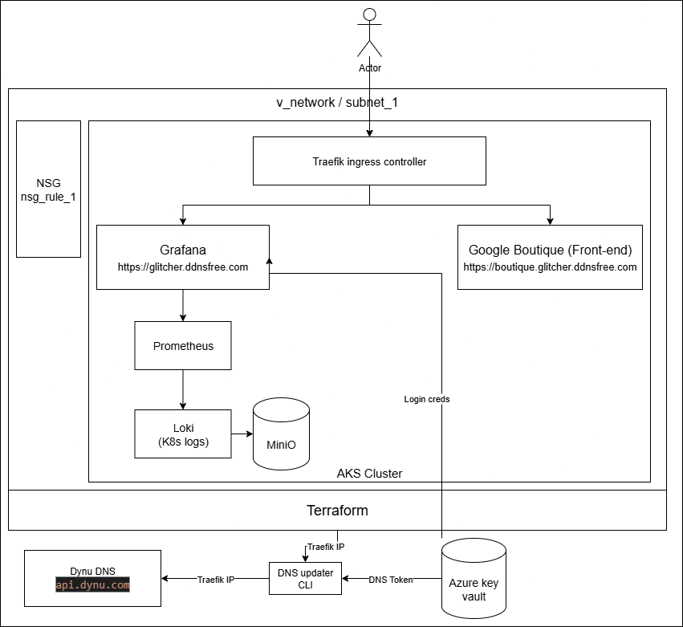

# Monitoring & Ingress Stack on AKS

## Overview

This project deploys a monitoring and ingress stack on an Azure Kubernetes Service (AKS) cluster using **Helm** and **GitHub Actions** for CI/CD.  
It includes:

- **Traefik** (ingress controller, HTTPS termination, Let's Encrypt certificates)
- **Grafana** (visualization)
- **Prometheus** (metrics collection)
- **Loki** (log aggregation)
- **Alloy** (Kubernetes log forwarding to Loki)
- **MinIO** (object storage for Loki chunks)
- **Boutique** (Google boutique service)

**Helm-Based Installation** — Manually Helmified Online Boutique microservices and observability stack

- Boutique accessible at: https://boutique.glitcher.ddnsfree.com
- Grafana portal accessible at: https://glitcher.ddnsfree.com

---

<p align="center">
  
</p>

---

## Screenshots

| Online Boutique UI                           | Prometheus Metrics                           | OpenTelemetry Traces (Tempo)                |
|----------------------------------------------|----------------------------------------------|---------------------------------------------|
|           |    |   |

---

## Architecture



---

## Features

- Manually created Helm charts for Online Boutique (no official charts exist)
- Extracted hidden environment variables for observability:
  - `ENABLE_TRACING`
  - `COLLECTOR_SERVICE_ADDR`
- OpenTelemetry traces operational on all supported services via Tempo
- Prometheus and Grafana deployed for cluster and service monitoring
- Prometheus alerts and slack integration configured

---

**Current flow:**

1. **Traefik** handles HTTP & HTTPS traffic.
   - HTTPS certificates managed via Let's Encrypt.
2. **Grafana**
   - Pre-provisioned with Loki & Prometheus datasources.
   - Password is stored in Azure Key Vault.
3. **Prometheus**
   - Installed via `prometheus-community/kube-prometheus-stack`.
4. **Loki**
   - Single binary mode.
   - Uses MinIO backend (also deployed in the cluster).
   - Alloy sends Kubernetes pod logs to Loki.
5. **MinIO**
   - Provides object storage for Loki chunks.
   - Ephermal.
6. **Boutique**
   - Google Boutique service.
7. **Azure Key Vault**
   - Stores sensitive values (Grafana admin password, Traefik API token, slack address for alerts).
8. **Dynu DNS**
   - REST API calls to DynuDNS to dynamically update the DNS for https://glitcher.ddnsfree.com and its subdomain

---

## Deployment

### Prerequisites

- Azure CLI
- kubectl
- Helm
- Terraform
- GitHub Actions configured for OIDC authentication with Azure

### Steps

1. **Ingress & DNS**
   - DNS updated via [Dynu API](https://www.dynu.com/) an API TOKEN is needed (account required).
   - DNS updater script runs on infra deployments; IP changes also trigger an update.
2. **Secrets**
   - Dynu DNS token fetched from Azure Key Vault in CI/CD pipeline before deployment as "dynu-token"
   - Grafana password fetched from Azure Key Vault as "grafana-admin-password"
   - Slack URI fetched from Azure Key Vault as "slack-uri"

### CLI Deployment, Configuration, Teardown

```bash
terraform apply -auto-approve -var="location=LOCAION" -var="environment=ENVIRONMENT"
az aks get-credentials --resource-group RG_main_LOCATION_ENVIRONMENT --name AKS_cluster --overwrite-existing
bash deploy-apps.sh    # Deploy all apps and helm configuration
bash update-dns.sh     # Fetch ingress IP and update DNS provider
bash update-ingress.sh # Update ingress
```

---

## CI/CD Workflow

- Run config.yml for deployment and configuration.
- Run teardown.yml for full teardown.

---

## Project Structure

<pre> 
├───.github
│   └───workflows
├───.terraform
│   ├───modules
│   └───providers
│       └───registry.terraform.io
│           └───hashicorp
│               ├───azurerm
│               │   └───4.33.0
│               │       └───windows_amd64
│               ├───helm
│               │   └───3.0.2
│               │       └───windows_amd64
│               └───kubernetes
│                   └───2.38.0
│                       └───windows_amd64
├───boutique
│   ├───charts
│   └───templates
├───helm_values
│   ├───alloy
│   ├───grafana
│   ├───ingress-routes
│   ├───loki
│   ├───otel
│   ├───tempo
│   └───traefik
├───modules
│   ├───cluster
│   ├───namespaces
│   ├───NSG
│   └───vnet
└───screenshots
</pre>

---

## 👤 Author

[Glitcher255](https://github.com/glitcher255)

---

## 📝 License

This project is licensed under the [MIT License](./LICENSE).
